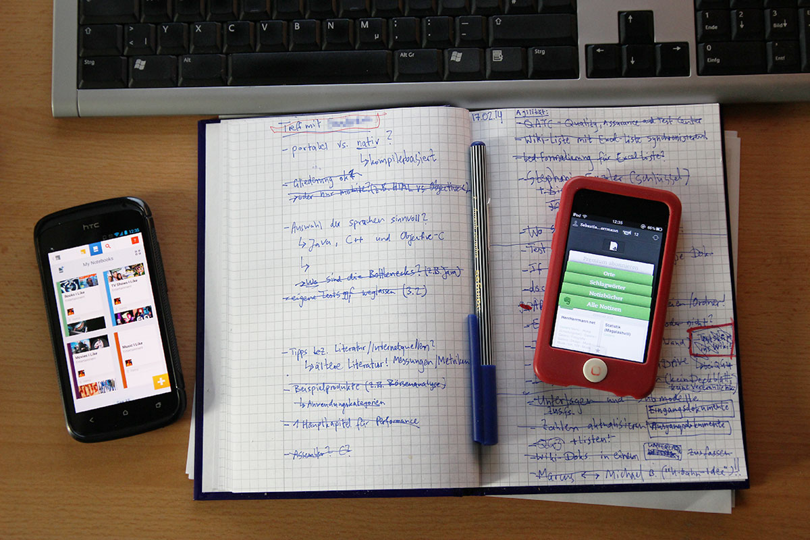

Ich mag Notizen und To-Do-Listen! Die beiden Methoden helfen mir, viele Aufgaben gleichzeitig zu verwalten, zu priorisieren und motiviert zu bleiben (offenbar streiche ich gerne abgearbeitete Stichpunkte durch).

Digitale Notizen haben den Vorteil, sehr gut verfügbar zu sein. Statt dem Aufschlagen des analogen Notizbuchs genügt ein kurzer Login im Browser oder das Starten der App auf dem Smartphone (oder iPod Touch). Zudem lassen sich kinderleicht Links, Bilder und andere Dateien anhängen. Und ich möchte sogar meinen, dadurch Ressourcen wie Papier und Stiftfarbe zu sparen.

Nichtsdestotrotz nutze ich noch beide Medien, denn so richtig intuitiv und schnell funktionieren die Notizen in meiner bisher verwendeten Anwendung [Evernote](https://evernote.com/) dann eben doch nicht. Ich mag Pfeile, Unterpunkte, Markierungen und kleine Skizzen - hier haben Stift und Papier noch klar die Oberhand. Auch, wenn Evernote mittlerweile versucht, die beiden Medien Papier und App auf [interessante Weise](http://evernote.com/partner/moleskine/) miteinander zu verknüpfen.

Demnächst werde ich Springpad (mittlerweile down!) ausprobieren, welches etwas andere Ansätze verfolgt, aber nette Funktionen bietet, um z.B. schnell To-Do-Listen zu erstellen (die in Evernote teilweise noch etwas buggy sind).

Ich bin gespannt, wie sich Springpad schlägt! Den Kurzbericht wird es dann hier zu lesen geben.
