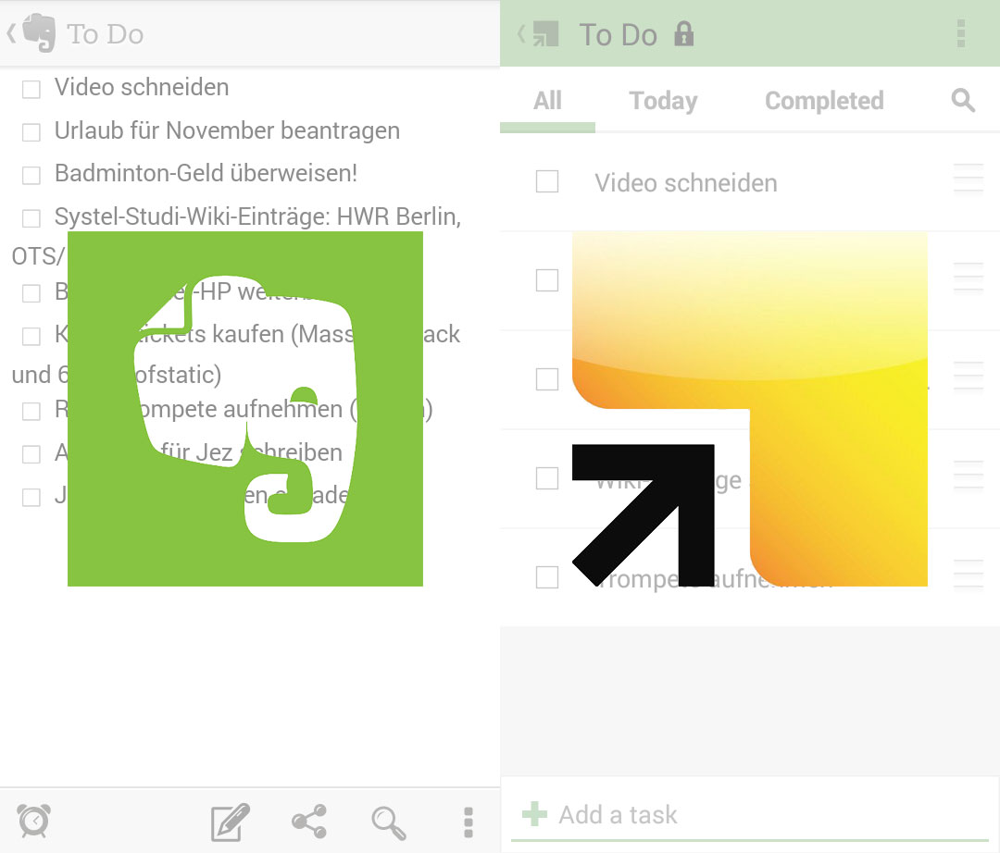

Nunja, besonders lange hat mein Testlauf von Springpad letztlich nicht gedauert, denn schnell musste ich mit großen Bedauern feststellen, dass eine für mich selbstverständliche Desktop-Anwendung bei Springpad gänzlich fehlt! Mit dem Smartphone lassen sich Notizen zwar offline verwalten, allerdings möchte ich das auch weiterhin oft mit dem Laptop tun - außerhalb von Browser und Internetverfügbarkeit.

Springpad erschien mir anfangs wegen der netten ToDo-Listen als sehr interessant, allerdings ist diese Euphorie nun schnell verflogen. Zudem musste ich feststellen, dass mein Springpad-Account durch die Anbindung an facebook ungewollt mit zahlreichen Einträgen gefüllt wurde - nämlich zu allen Musik- und Filmeinträgen, die mir auf facebook gefielen. Eine Funktion, die ich nicht brauche, nicht möchte und die sich kaum komfortabel wieder rückgängig machen lässt (offenbar können diese Einträge nur händisch nacheinander gelöscht werden).

Hier wurde eigentlich alles weitere zum Vergleich Springpad/Evernote gesagt. (Link ist mittlerweile offline.)

Fazit: Ich bleibe vorerst bei [Evernote](https://evernote.com/intl/de), welches mir nette Anwendungen für Android, OSX und Windows bietet und alle Funktionen beherrscht, die ich für meine Notizgeschichten brauche - mittlerweile sogar mit [Handschriftfunktion](http://blog.evernote.com/blog/2014/03/05/handwriting-arrives-evernote-android/?utm_source=facebook&utm_medium=social_media&utm_content=mar5&utm_campaign=news).

P.S.: Als Konkurrenz könnte noch Microsofts [OneNote](https://www.onenote.com/) in Frage kommen, allerdings möchte ich weiterhin kostenfrei Notizen erstellen und generell auch ein wenig von Microsoftprodukten Abstand nehmen (vielleicht sollte ich noch etwas zu meinen Erfahrungen mit Windows 8.1 und Office 2013 schreiben?).

Update: [SpringPad](http://www.theverge.com/2014/5/22/5741602/one-time-evernote-pinterest-rival-springpad-to-close-its-doors) ist mittlerweile offline!
