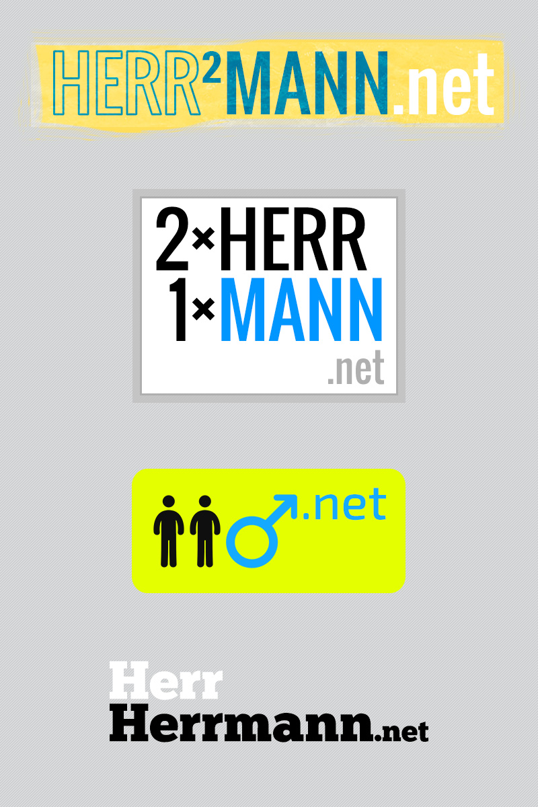

Lasst die kreativen Säfte nicht verharren! Ständig mach' ich Notizen und bastle an Logos (und Webdesigns und [Musik](https://soundcloud.com/bm_128 "SoundCloud")). Hier ein paar Beispiele, die zwar nicht final umgesetzt werden, mir aber mehr oder weniger spontan aus der Maus geflossen sind.

