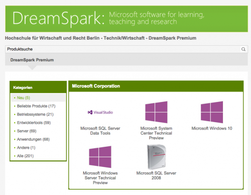

It's a good time to be a student! Usually, students (and teachers or other faculty staff) can already get interesting discounts from retailers and software companies like [Amazon](http://www.amazon.de/b?ie=UTF8&node=469664031), [Apple](https://www.apple.com/de-edu/store), [Ableton](https://www.ableton.com/de/shop/education/), [Adobe](https://www.adobe.com/de/creativecloud/buy/students.html) and [Autodesk](http://www.autodesk.com/education/free-software/all). But recently [JetBrains](https://www.jetbrains.com/) also decided to give out their cool IDEs to students and educators [for free](https://www.jetbrains.com/community/education/). Same goes for [GitHub](https://github.com/) which decided to not only give you a micro account for free for two years but bundled it with additional licenses for other platforms as well: they call it [GitHub Student Developer Pack](https://education.github.com/pack).

Just to complete the list: [Microsoft](https://www.microsoft.com/de-de/store/b/student) is also offering lots of advantages for students. My school is for example giving out _Microsoft Imagine_ (formerly _DreamSpark_) licenses to every student. That lets us download Microsoft Operating Systems and other Microsoft software for free (even new Windows preview versions or the Visual Studio IDE).

