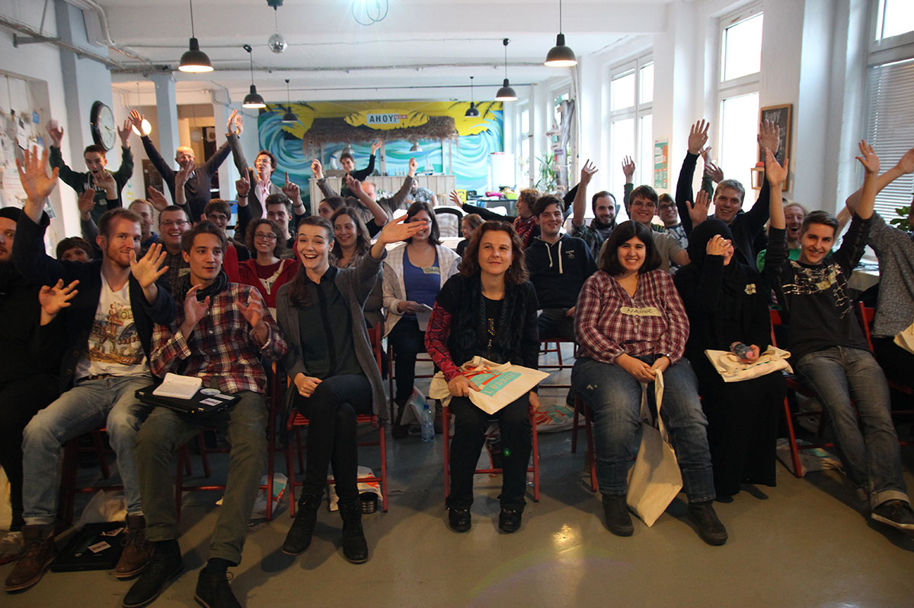
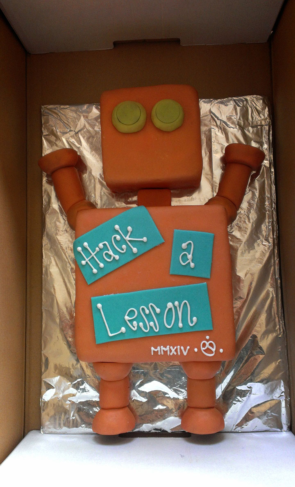

Requested by one of our professors Mrs. Prof. Dr. Lemke, we organised our own little hackathon in Berlin last weekend! Since the topic was all around teaching beginners how to code we called it _Hack-a-Lesson_ and invited people to create some nice concepts and ideas that will eventually influence the second volume of Mrs. Lemke's book [Einführung in die Wirtschaftsinformatik](https://www.amazon.de/Einf%C3%BChrung-die-Wirtschaftsinformatik-Verstehen-Zeitalters/dp/3662440644/).

Hack-a-Lesson lasted for two full days, Saturday and Sunday, and we got 32 people to join and work together in 6 teams while we tried to keep them alive with food and drinks while also observing the event and eventually rating the results (because there were some serious prizes involved, too!).

It was a great experience and the feedback was more than positive from all sides so far. We were even featured in a long article in the Berliner Zeitung (no longer available online). I'm glad I was able to work as part of a great team and collect new experiences and got to know new people that way while at the same time making other people happy.

Nonetheless for now I'll return to being a participant of those kind of events again. :)

P.S.: Check out that awesome cake that was made just for that event!

