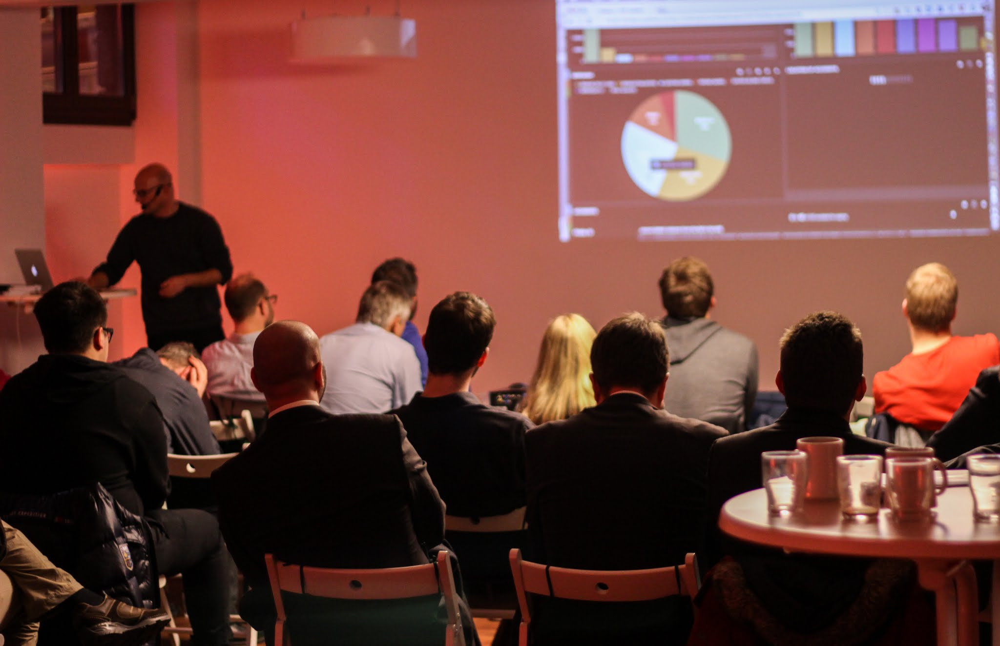

I wouldn't have expected to be involved in some tech event so immediately again after organising Hack-a-Lesson but since I have been back in Frankfurt (Main) for work reasons, my colleague and friend [Darren Cooper](https://plus.google.com/+DarrenCooper7590/ "Darren Cooper on Google+") quickly invited me to co-organise a GDG (Google Developer Group) event!

This time it was the [TalkTime Xmas Special 2014](https://plus.google.com/events/cb16ps8l0tfkg8mob36q12halu0 "GDG Rhein-Main TalkTime Xmas Special 2014"), basically four talks about Google- and Android-specific topics. Some of those topics were really interesting, like the one about Google's webdesign framework [Polymer](https://polymer-library.polymer-project.org/3.0/docs/devguide/feature-overview) that I'm motivated to try out now.

