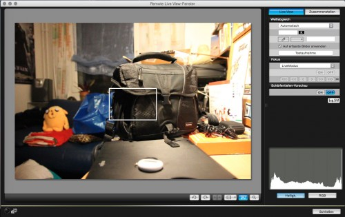

A few years ago, I bought a DSLR camera by Canon, and I’m very happy with it. What grinds my gears is that Canon users are required to keep and use their packaged software _CD_ whenever they need to install the corresponding software for their cameras. Because all you can get online are "updaters" that would update the previously-installed tools (which you’re supposed to install via CD only).

Luckily, there are easy ways \[there used to be a link here, but the target website is no longer available\] to alter those updaters in order to properly install the tools without the need of a CD. I’m just wondering what the motivation behind this installation/update policy is. Does it really hurt to give proper installers to everyone via the internet, and forget about putting CDs in the boxes? (Let alone four thick manual books in four different languages.)

