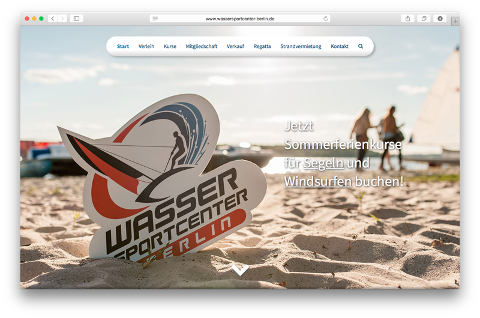

Hey, today we (my co-student Lennert and me) published a new website for a water sports center in Berlin! It's simply called [Wassersportcenter Berlin](http://www.wassersportcenter-berlin.de/).

 

The new website is based on WordPress and some plugins for the events/booking system. It was once again a cool experience to work on a bigger project and knowing that the website will be seen by many visitors and customers is a good place to start and stay motivated.

Overall I'm also very satisfied with WordPress' customisation features and the easily usable and  [well-documented](https://developer.wordpress.org/reference/) API. Also this is one of my first projects featuring a lot of SVG graphics - they're basically being used for all images except for photos.

Go ahead, check it out and book a course if you want to learn surfing or boating.
