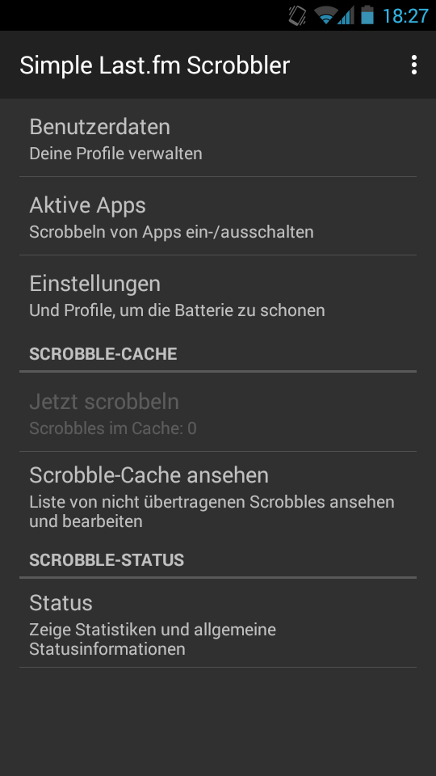

Yesterday, I translated the Android app _Simple Last.fm Scrobbler_ (no longer available) to German! It can be used to scrobble your music tracks from various music apps to Last.fm (or Libre.fm). I’m using it, too, with my favorite Android music player: [Shuttle](https://play.google.com/store/apps/details?id=com.simplecity.amp_pro).

Anyway, expect to see the app in German (in case your Android system language is set to German) with the next update!
