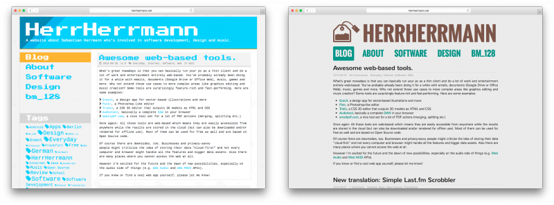

\[caption id="attachment\_615" align="aligncenter" width="800"\] Before and now.\[/caption\]

That's basically it!

And I'm also planning to open-source this new theme because I hand-crafted it carefully and I think it might be useful for other people/bloggers/WordPress users, too. I'm just doing some last adjustments and fixes right now, so it'll probably appear online and hackable in a few weeks.

**Update:** The theme is now being developed [on GitHub](https://github.com/herrherrmann/tea-time).
