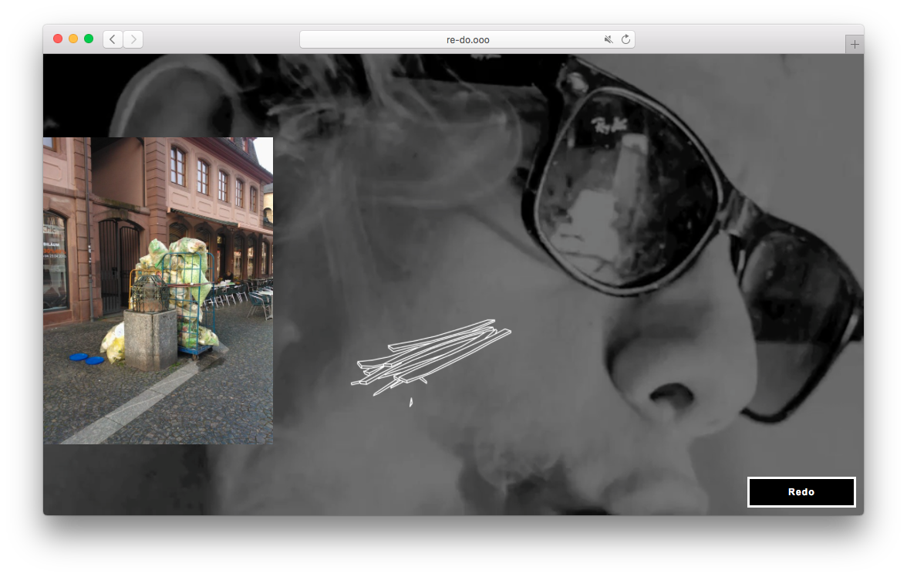

Supporting the bachelor's thesis of my friend [Vincent](https://finzvon.tumblr.com/) I made a little website that offers something like a "culture generator". Using random (rarely seen) YouTube videos, photos and drawings, the website generates random art on every visit.

