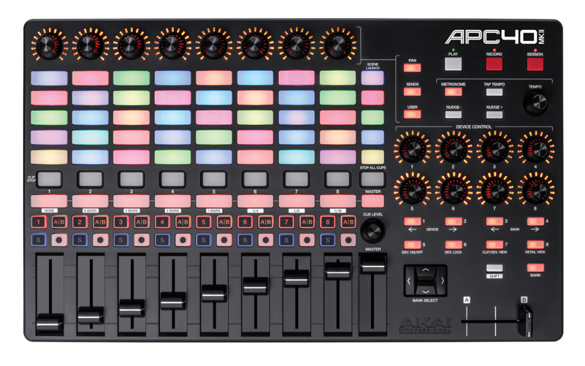
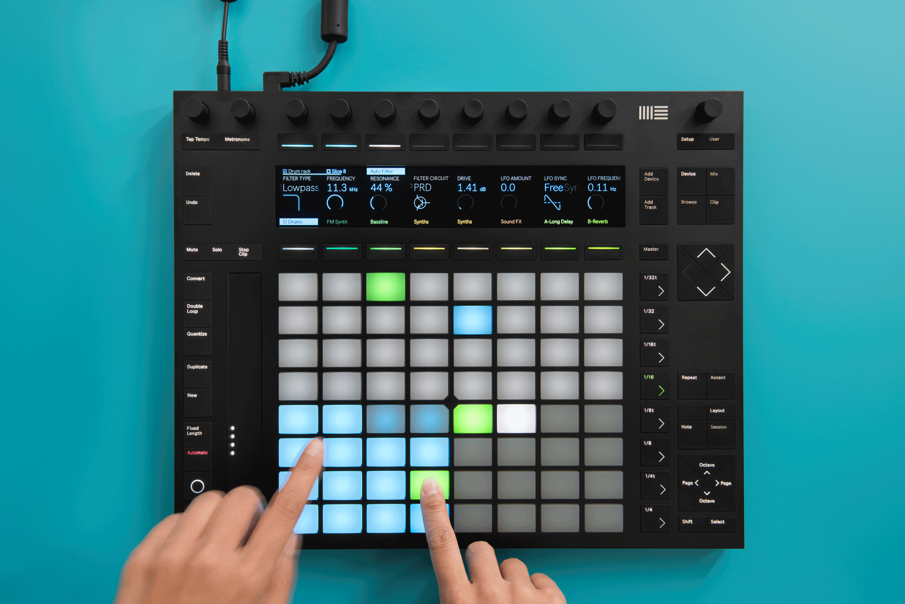

**Disclaimer:** This post will not be interesting to you if you’re not that much into computer-based music production and/or MIDI controllers.

I recently acquired a new audio interface. It’s beautiful and I love it. It’s as if someone went around and asked people what they are expecting from a good audio interface. Then that someone went home (i.e. to their _company_) and built it. The amount of available audio interfaces on the market is incredible, and it shows how many different people’s needs and manufacturers’ responses there are. In my case, I was lucky enough to either have a very common setup that is being covered by this audio interface (and probably some others) or someone was eager enough to push for those exact requirements (could be a customer, product manager or someone else).

Regarding MIDI controllers, I think we’re on a similar level. Especially when it comes to small portable devices, there’s a big variety to choose from. Regarding [Ableton Live](https://www.ableton.com/de/live/) controllers, the selection is understandably smaller. Right now, there’s Ableton’s own [Push](https://www.ableton.com/de/push/), Akai’s [APC 40](https://www.akaipro.com/apc40-mkii) and Novation’s [Launchpad](https://novationmusic.com/launch) that kind of started it all back in 2009.\* Then there are smaller versions of those that sometimes even work well with iPads and are arguably more targeted towards (casual?) musicians on the go. I tried out many of those Ableton Live controllers and since I always found some flaws that bugged me out, I’m wondering whether someone will ever build the perfect Ableton controller for my needs (just like what happened in regard to the audio interface)?

<!--more-->

The Ableton Live controller of my dreams would certainly feature elements that already make the current controllers so great.

## Inspiration from Akai APC40 mkII

- LED-encoded rotary knobs that indicate the currently set values – I can’t believe how few controllers are using those nowadays
- Dedicated buttons for activating/arming/solo’ing tracks (I don’t care about the A|B button)
- Dedicated (and clearly distinguishable) buttons for stopping clips (individual clips and all at once)
- RGB-colored pads (although with those I always lose overview because there’s no way to differentiate _green_ clips from _running_ clips and the same goes for red/recording)
- Being USB-powered (it’s always nice to rely on less gear that can break or be forgotten)

## Inspiration from Ableton Push 2

- The Ableton integration (managing clips, tracks, device parameters etc.) – basically being able to play and experiment without using the laptop screen
- A small screen that shows which parameters are currently being mapped to the rotary encoders (doesn’t even have to be as fancy as in the second Ableton Push, as long as it’s well-readable)
- The design and build quality (although button labels could surely be bigger and/or more distinguishable)
- The pitchbend touchfield (I really like using it to give synthetic sounds a more organic feel)
- Two foot switch inputs that can be mapped to different functions

## Inspiration from Novation Launchpad Pro

I also took a look at the Launchpad, of course, but really couldn’t find any exclusive features that would further improve my controller of dreams. That doesn’t mean it’s not a good device – I'm sure it’s a big source of inspiration for all kinds of pad controllers (and apps).

## Conclusion

Controllers are great, and dreaming about them is fun (at least for me). I really can’t wait to see what the next generations of the aforementioned devices will deliver and how their developers will improve them. After all, they need to convince existing customers to migrate or upgrade from their first- or second-grade devices to the new generation. It’d also be great to see even more variety when it comes to future Ableton Live controllers (don’t forget about my LED encoders, dear developers).\*\* Until then, I’ll stick to what’s available and am happy about how minor my problems in this world are.

**Bonus Link:** If you don’t know it yet, check out the beautiful and well-maintained list of MIDI controllers at [Controllers.cc](https://controllers.cc/).

\* If you want to be more lenient, you could also count devices like Livid Instruments’ Base and [various iPad apps](https://help.ableton.com/hc/en-us/articles/209071989-App-for-controlling-Live-with-an-iOS-or-Android-device) as Ableton controllers. But in this case, I’m talking about hardware specifically built for Ableton. \*\*So while wishing for a more diverse controller market, I’m at the same time dreaming about a device that merges the best out of two existing devices, effectively consolidating the selection.
