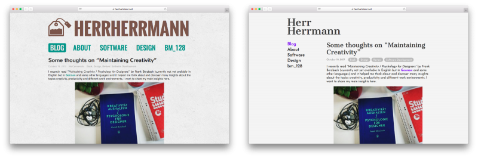

About two years after the [last re-design](/blog/a-re-design/) I decided to give it another go and optimize my site’s design again. This time I paid special attention to the selection of fonts in order to achieve consistent and readable typography. You’ll also notice that most of the decorating elements are gone in order to "let the letters speak" for themselves.

Because it’s not exactly the golden ratio, I named this theme "Silver Ratio". Its code is available on [GitHub](https://github.com/herrherrmann/silver-ratio).

P.S.: In hindsight I realized that my layout and font choices (and maybe the whole idea of the re-design) was greatly inspired by the [blog of Jan Heuermann](https://www.jotaen.net)! Thanks for that, Jan.
