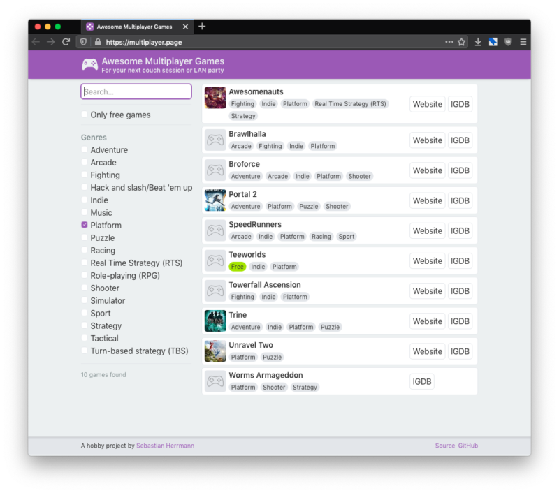

Do you like playing games with other people? If so, you might often wonder _what_ to play while looking at huge lists of games in your library or some game shop.

I wanted to make this easier and learn some new technology on the side (in this case backend development with NestJS), so I built a little webapp for finding awesome multiplayer games: [multiplayer.page](https://multiplayer.page)!

It's also easy to add your own entries if you have a GitHub account – you'll find all information here: [https://github.com/herrherrmann/awesome-multiplayer-games](https://github.com/herrherrmann/awesome-multiplayer-games) – In fact, [quite some people](https://github.com/herrherrmann/awesome-multiplayer-games/graphs/contributors) stumbled over this repo already and added new games which is fantastic!

In this sense: Game on and long live open source. ?
