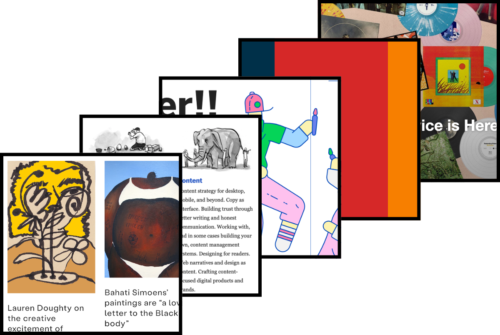
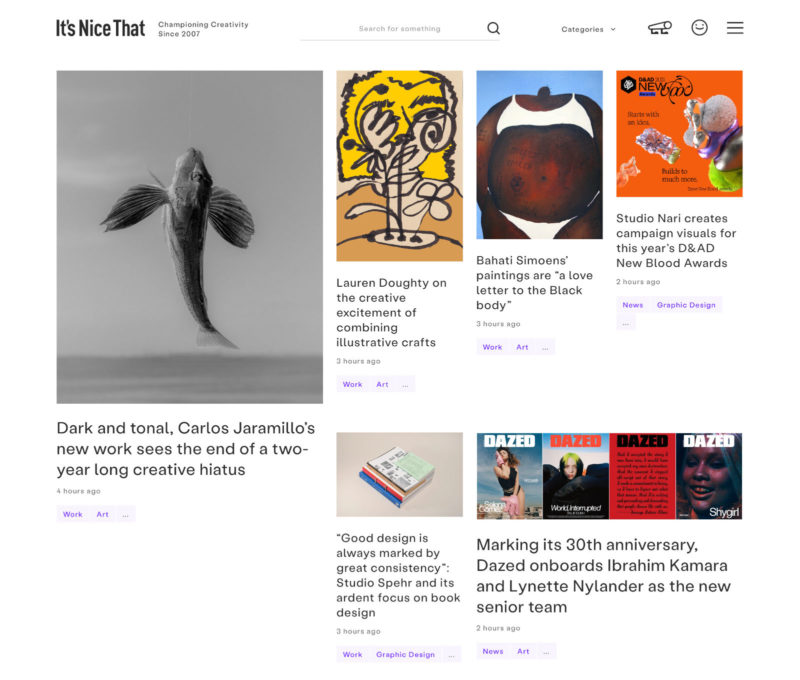
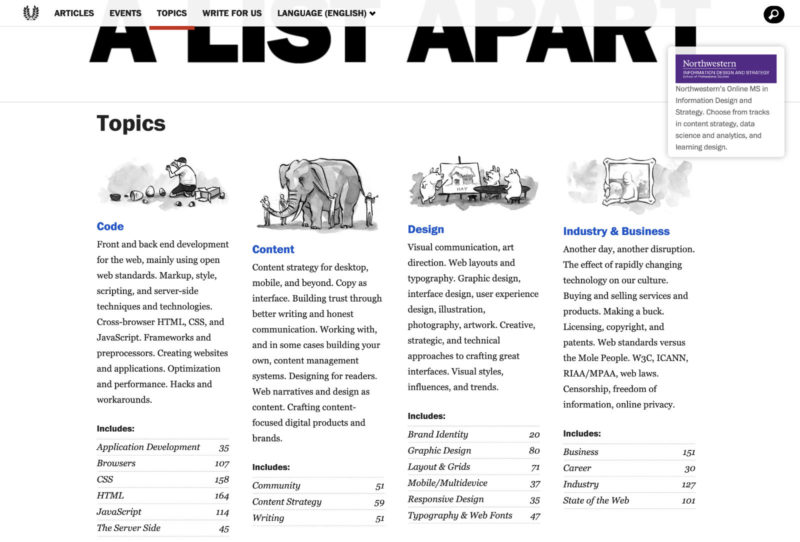
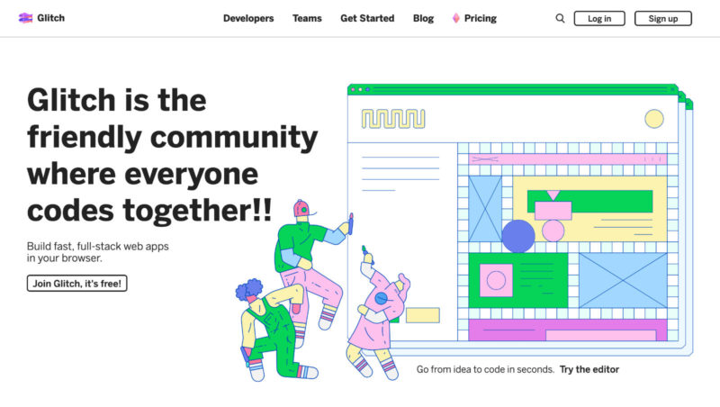
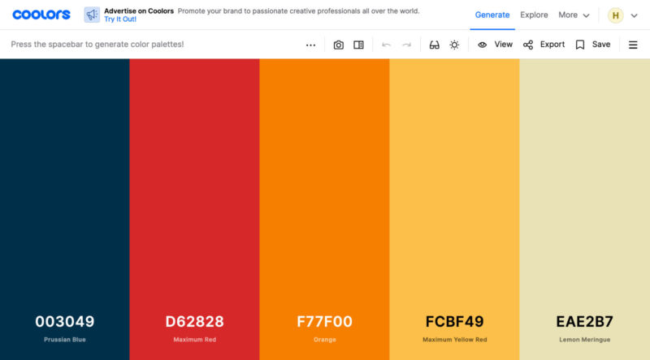

I’ve finally found the motivation to compile a list of my favorite websites! These following pages are very cool™ because they either look super nice, offer great content or do both. And they don’t feature the current trends that make the web worse: Offensive advertising, affiliate-based opinion making, obsessive user tracking. Let’s get started.

<!--more-->

## [It’s Nice That](https://www.itsnicethat.com/)

A great design magazine covering a diverse range of topics that are somehow _all_ super interesting and informative. It’s very easy to browse and also find older gems and inspiration on there. Instead of relying on advertising, they recently launched their own [premium subscription option](https://www.itsnicethat.com/extranice).

## [A List Apart](https://alistapart.com/)

Another web magazine that doesn’t try to sell you the latest framework or library but focuses on more cultural and psychological topics of web design and development. They also run a great series of mini books about these topics, [A Book Apart](https://abookapart.com/).

## [Glitch](https://glitch.com/)

Glitch is a developer-centric community and collaborative code editor that invites everyone to experiment and “remix” ideas from each other. I love their playful colors, thick borders and overall aesthetics.

## [Coolors](https://coolors.co/)

At heart, Coolors is “just” a color palette generator but it executes this idea so well that I keep going back to it, even for simple tasks like creating some variations of a base color. You can also just open their [generator](https://coolors.co/generate) and keep pressing spacebar until you stumble upon a nice color combination.

## [Bandcamp](https://bandcamp.com/)

Bandcamp is my favorite way of purchasing music nowadays. A lot of my favorite artists do sell their albums there in a digital and/or physical format, it’s a transparent company that genuinely seems to care about creativity and artists and they offer more and more cool features like their blog ([Bandamp Daily](https://daily.bandcamp.com/)) and web radio ([Bandcamp Weekly](https://bandcamp.com/?show=414)).

That’s it for this year!
