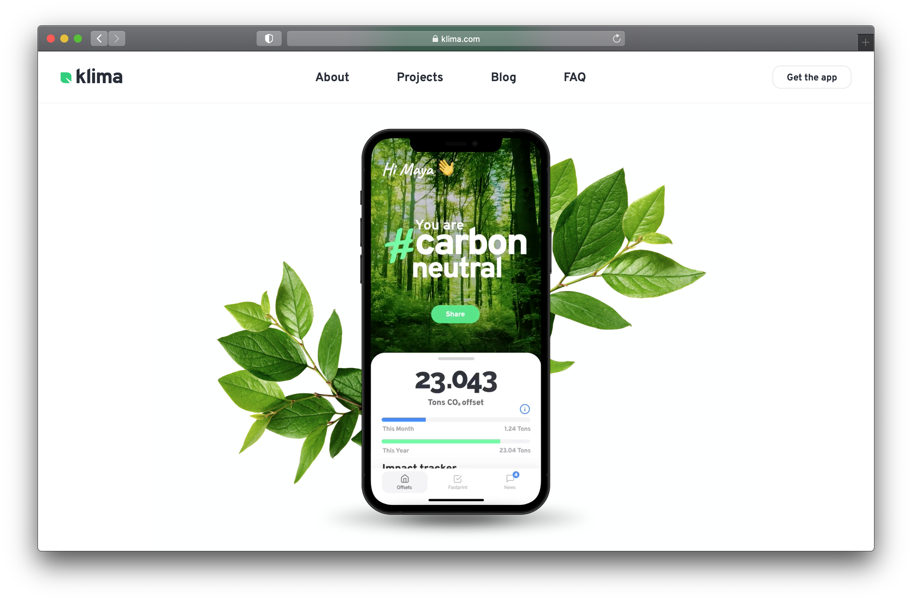
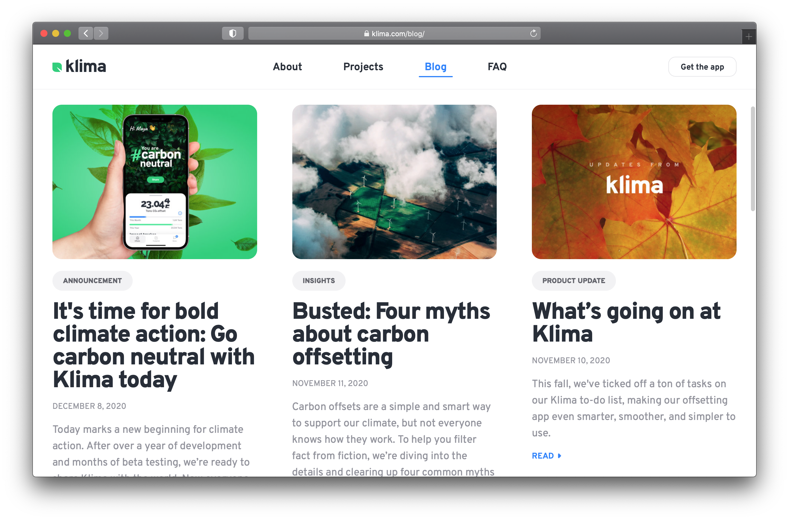
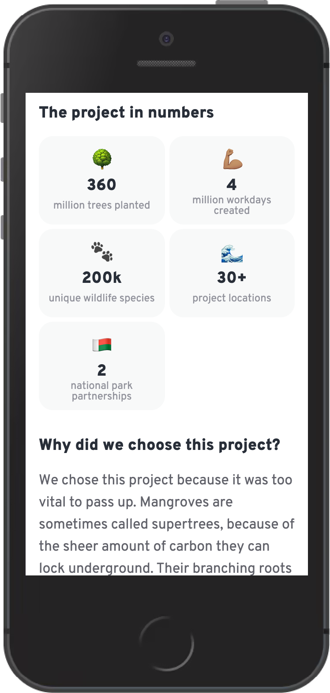

We already launched in December last year but I didn’t blog about it, so here’s a belated celebration: [Klima.com](https://klima.com/) is live! It’s a website that Jonas, co-founder and CPO of Klima, designed and I had the pleasure of implementing. It accompanies the launch of the Klima apps on iOS and Android and provides more information about our product, the company behind it, and general climate news.

<!--more-->

To be exact, this is a relaunch because Klima.com existed before already. However, this new version was built from scratch with a different set of technologies and more content. The idea is to grow and scale it further over the next years, so there was a big focus on reusability and consistency.

I’m very happy with the result!

- The page loads quickly because it is server-side rendered and loads images and additional client-side code on demand.
- The architecture is clean, we have a nice set of reusable components and even a little component library.
- A lof of the content is loaded dynamically and can easily be edited by non-developers.
- Everything is accessible, from semantic HTML to keyboard navigation, screen-reader-friendly labeling, and (mostly) appropriate font sizes and color contrasts.
- I learned quite some things along the way (see below for details).

## Learnings

I wanted to note down my biggest learnings from this project, because there are a lot and it’s nice to have them documented somewhere. That means it gets very technical here!

### Next.js is cool, fast and easy

We’re using [Next.js](https://nextjs.org/) to render React components on the server, which makes the pages load very fast. I was especially surprised how simple and easy it was to get started with it. If you’re building websites with React nowadays, I’d highly encourage taking a look at server-side rendering with Next.js, [Gatsby](https://www.gatsbyjs.com/) or alike!

### Serving the right images

Since the Klima website is quite immersive with a lot of big images and sometimes videos, it made sense to look into optimizing the delivery of these assets. There are at least two dimensions to this: The viewport size of the browser and the pixel density of the screen. For the pixel density, we are fine with just distinguishing between "regular" (1x) and "retina" (2x) screens – regular screens will load images in the base resolution, while retina screens will load images in twice the resolution (to appear nicely sharp).

We initially used the [image-set](https://developer.mozilla.org/en-US/docs/Web/CSS/image/image-set) CSS property until we realized that Firefox [does not support](https://caniuse.com/css-image-set) it at all. Fortunately, the `<image>` element supports the same flexibility thanks to its `srcset` property. As usual, there’s a great guide to learn about all this on CSS-Tricks: [A Guide to the Responsive Images Syntax in HTML](https://css-tricks.com/a-guide-to-the-responsive-images-syntax-in-html/). Once the `<image>` tag was in place, it was also easy to add [lazy loading](https://web.dev/lazy-loading-images/) for bigger images further down in the viewport. And thanks to the [object-fit property](https://developer.mozilla.org/en-US/docs/Web/CSS/object-fit) it was easy to properly resize and align images without any accidental stretching.

### Contentful as a powerful headless CMS

We’re using [Contentful](https://www.contentful.com/) to serve dynamic content to our website – the content is loaded and assembled on the server side, again thanks to Next.js. I was forced to think about sensible data models and come up with good abstractions to make the content editable and the structure understandable for non-developers as well. With Contentful, you get a lot of additional features that might make it easier to scale later on: Translatable fields, an image CDN (to load images in the formats and sizes you need), and integrations with many platforms. But there are also many other headless CMS out there, so pick whatever suits your needs!

### Make it move a little

Adding subtle (and sometimes less subtle) animations and transitions can make a website feel much more engaging and snappy. I did quite some experiments to find out _how_ much things should be moving around. Often times, a bit of animation is good but a lot of layout shifting is too distracting (after all, there’s a lot of content to focus on). Also, we turn off the bigger animations for users that [prefer reduced motion](https://developer.mozilla.org/en-US/docs/Web/CSS/@media/prefers-reduced-motion).

### Type safety with TypeScript all the way

I’m quite proud of our TypeScript setup: Our style variables are typed, our CMS fields are typed, our tests are typed, our helper scripts are typed – that means we can profit from auto completion and type safety everywhere and I feel confident that not _everything_ will explode when I apply changes or refactorings.

## Closing remarks

A project is never done, so keep your eyes open for new things coming from Klima! And check out the [mobile app](https://klima.com/download/), if you haven’t yet. ✌️
