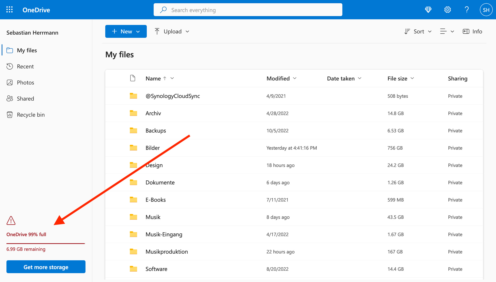
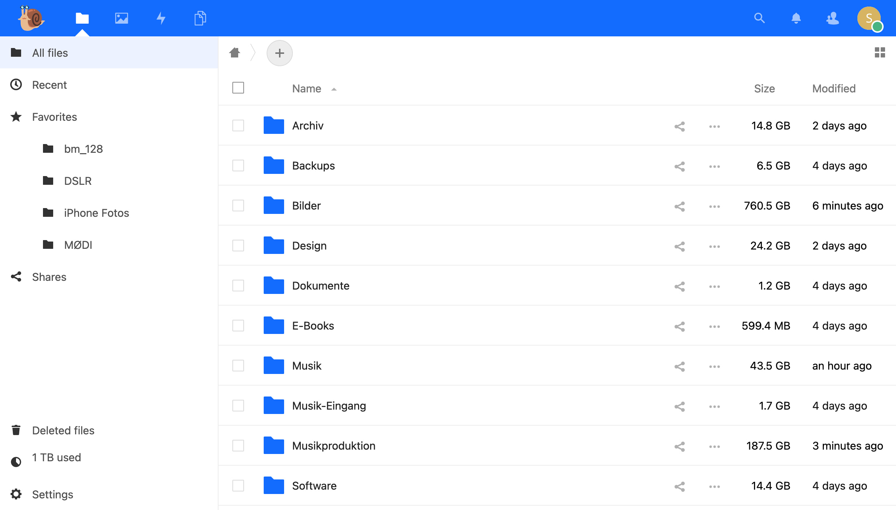
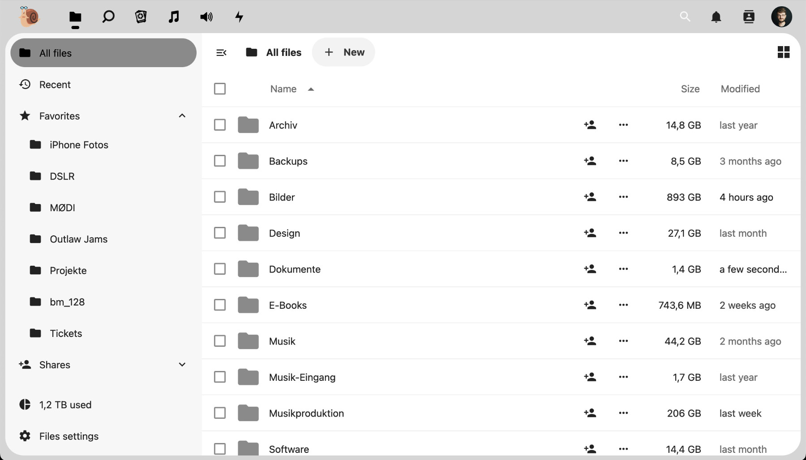
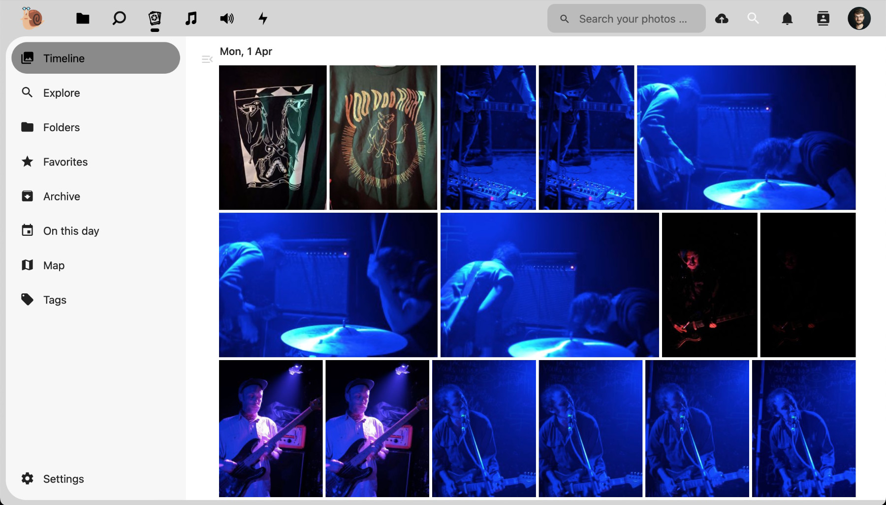

This post documents my journey to find a cloud storage provider that is better than Microsoft OneDrive and migrating all my cloud files there.

In general, I want to store (some of) my files in the cloud for these reasons:

- I want to have the data available on different devices (mostly a MacBook and an iPhone).

- I want to back up the most important files, so I don’t need to worry about losing access if I lose or break my devices.

- I want to share specific files and folders with other people from time to time (for collaborations or just to share a folder with images or videos).

All in all, I’ve accumulated around 1 terabyte of files in the last years. This includes:

- Photos from different cameras and smartphones (~750 GB)

- Music projects, including recorded and processed audio files (~170 GB)

- MP3s with music that’s not available on any streaming platforms (~45 GB)

- Design projects, including assets and exports (~25 GB)

- Backups from other devices, video game save files, etc. (~22 GB)

- Videos and video projects (~17.5 GB)

- Text documents, scans of letters, etc. (~1.5 GB)

With this amount of data, I’ve run into the storage limit of my current storage provider, Microsoft OneDrive. With my Microsoft 365 Personal subscription (69€ per year), I’m only entitled to 1 TB of storage (plus some extra gigabytes from some special discounts or events).

<!--more-->

Of course, I could upgrade my OneDrive plan to gain a higher storage limit (e.g. an increase of 200 GB costs 2€ more per month), but I wanted to look into alternatives to OneDrive anyway.

## Why OneDrive sucks

I’ve used OneDrive for many years now, and I’m very fed up with it.

- Anything related to OneDrive is very slow: Browsing files in the web UI, uploading files, downloading files, and even starting and stopping the macOS client app.

- The OneDrive client on macOS is using _lots_ of resources and takes ages to start, react to any clicks, and sync changes. Often times, it simply breaks and doesn’t do anything anymore until it’s forcefully restarted.

- The upgrade costs are not very attractive or scalable – the storage upgrades only go up to a total of 2 TB, which also more than doubles the original price of my subscription.

- OneDrive (or Microsoft) does not offer any end-to-end encryption or a [zero-knowledge policy](https://en.wikipedia.org/wiki/Zero-knowledge_service).

## Where to migrate to?

I looked into different alternatives with these requirements:

- Having a higher storage limit – at least 2 TB, with the option to increase over time, if needed.

- Having sensible privacy protection, i.e. end-to-end encryption and a zero-knowledge policy of the provider. Ideally, I’d like my files to be stored in the EU as well (stricter data protection laws).

- Having a stable and fast client to sync files to macOS and iOS, that also supports partial sync of certain folders (I only need some folders locally for offline access).

After a bit of research, I discovered and tested the solutions listed below.

### Sync.com

[Sync.com](https://www.sync.com/) caught my eye in the past and looked good at first glance. They offer end-to-end encryption and client apps for all platforms. But the service was down for _several hours_ on my first day of using it (confirmed by their support). Their status page didn’t mention any problems for that time period, not even in hindsight. That seemed quite fishy to me. The overall design and UX of their web and native client was also quite terrible, so I begrudgingly moved on.

### Internxt Drive

[Internxt Drive](https://internxt.com/drive) seems to be a relatively new player with competitive pricing (albeit no plan beyond 2 TB of storage), flashy designs, and a strong [privacy selling point](https://internxt.com/privacy). When I tried their web and native clients, I was shocked about how slow everything was and how few features there were. They also do not offer any partial sync, only “all or nothing” sync of everything that is stored in their drive. I moved on.

### Icedrive

[Icedrive](https://icedrive.net/) seemed to tick all the boxes at first glance: They take [privacy](https://icedrive.net/encrypted-cloud-storage) seriously, they have a 5 TB plan, and seem to have apps for all platforms. After installing the macOS app, I figured that they only offer a proper file system integration on Windows. The macOS client is only a “portable” version of the web app and allows for basic uploading and downloading files, but not really any offline file sync.

### Tresorit

[Tresorit](https://tresorit.com) offers some file sharing features, but is clearly targeted towards businesses. As far as I could tell from the website, they don’t offer any local file sync but are focusing on sharing and collaboration aspects. Their 4 TB plan is also quite hefty (24€ per month).

### pCloud

[pCloud](https://www.pcloud.com/eu) made me very happy, a few months back. Their data center is in Switzerland, they offer client-side encryption, and their pricing is very attractive (100€ per year for 2 TB). What I didn’t like was how they handle encryption: Users have to pay extra for the [encryption package](https://www.pcloud.com/encrypted-cloud-storage.html), and opening an encrypted folder will prompt you for a password every time! Overall, the encryption aspect seemed quite tacked-on and not really well integrated or practical to me. On top of that, I had issues migrating my OneDrive files with their OneDrive integration (any files and folders containing certain special characters would not be synced, and I only found out by spot-checking the migrated files). If pCloud improved their encryption integration and fixed the OneDrive integration, I probably would have gone with them!

### My own NAS server

I purchased a Synology DS220j (a NAS – basically, a hard drive case with network connectivity and an integrated computer to offer some additional functionality) to try out hosting all the files myself at home. What I didn’t like was how _slow_ everything was (indexing media or streaming files with a sensible speed was unthinkable). On top of that, I became very busy with managing software, installing updates, configuring the network access, renewing certificates, etc. – To a degree, I became a cloud provider myself. And if anything happened to my trusty server, all my files would potentially be gone. So, even though I like the DIY aspect of it, having my own NAS was not a viable long-term solution.

### Nextcloud

I was close to giving up until I did one final round of research and gave [Nextcloud](https://nextcloud.com/) a (second) try. Initially, I had Nextcloud installed on my NAS, but then I thought I could keep the advantages of Nextcloud and get rid of the self-hosting aspect by getting a _managed_ Nextcloud instance somewhere (as suggested on their [website](https://nextcloud.com/sign-up/)). Finding a good Nextcloud provider wasn’t easy, since there are many of them, their offers vary widely, and there does not seem to be a good overview of all the providers.

In the end, I opted for a Nextcloud offering by [Hetzner](https://www.hetzner.com/storage/storage-share), a big hosting provider in Germany. They seem mature and big enough to offer a stable hosting experience (I’ve worked for companies that are using Hetzner for their backend services, which gave me a confidence boost). The price of 14.19€ per month is not a steal, but on the other hand, it’s a future-proof offering with 5 TB of storage.

Side note: NextCloud’s OneDrive integration didn’t work properly, so I ironically had to use the NAS as an intermediate platform – Synology’s [Cloud Sync](https://www.synology.com/en-us/dsm/feature/cloud_sync) feature let me reliably fetch all files from OneDrive and then sync them with Nextcloud (via WebDAV).

## The new Nextcloud world

<figure>

<figcaption>

The Nextcloud web UI does not look fancy, but it is fast, configurable, and less buggy than OneDrive.

</figcaption>

</figure>

I love my new setup with a managed Nextcloud instance.

- Everything is _very_ fast, at least in comparison to OneDrive. The native clients start fast and sync files fast.

- The Nextcloud web client is neat and configurable (and did I mention _fast_?). I can finally have a list of favorite folders for quick access in the sidebar, and remove/disable features I don’t care about.

- Nextcloud offers their own set of community-powered apps to add more functionality beyond simple file storage – e.g. to preview camera RAW files or even add major features like email, calendar, or notes.

The setup is not perfect (yet) though:

- End-to-end encryption isn’t really there yet – there’s an [app for that](https://apps.nextcloud.com/apps/end_to_end_encryption)™, but it seems to be very buggy and has a terrible review score. This is very unfortunate, but my hope is that this privacy issue is at least mitigated by having my own instance of Nextcloud instead of needing to trust Microsoft with my data.

- Nextcloud apps seem to be quite hit-and-miss: When trying out a [third-party app to open archives](https://apps.nextcloud.com/apps/files_archive), it broke my whole Nextcloud web interface. The Hetzner support helped me fix this by disabling the app again, but I’m definitely shocked that I can lock myself out of the system by installing an erroneous extension (reminds me of my old WordPress times!). In general, it [seems](https://help.nextcloud.com/t/nextcloud-25-released-to-stable/147816/6) that major releases of NextCloud seem to be breaking compatibility with existing apps. That might also be the reason the Nextcloud version deployed on Hetzner is slightly behind the latest release (version 24 instead of 25).

## Bottom line

I think the migration was a success! The new setup is future-proof and more flexible than OneDrive could ever be. I might still spend a bit of time here and there to fine-tune things – but in general, I can recommend managed Nextcloud instances to people who need fast and open-source-powered cloud storage and want to take control of their data a bit more.

## Update from April 2024

I’m still happy! By now, my Nextcloud instance is running version 28, so the UI has improved changed a bit.

<figure>

<figure>

<figcaption>

Nextcloud files overview in version 28

</figcaption>

</figure>

<figure>

<figcaption>

Nextcloud memories app for viewing a photostream

</figcaption>

</figure>

</figure>

I haven’t encountered any major problems with my setup, and even “chaotic” movements of files and folders have been picked up and synced correctly by the macOS client.
