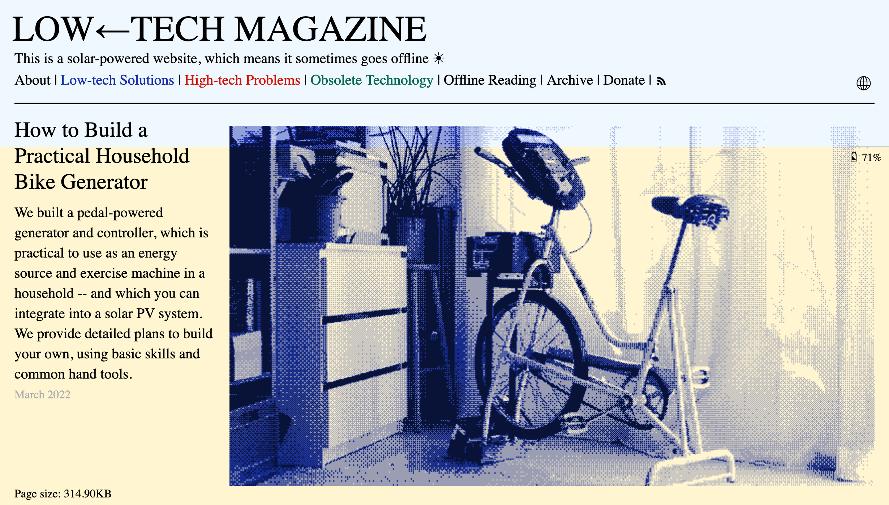
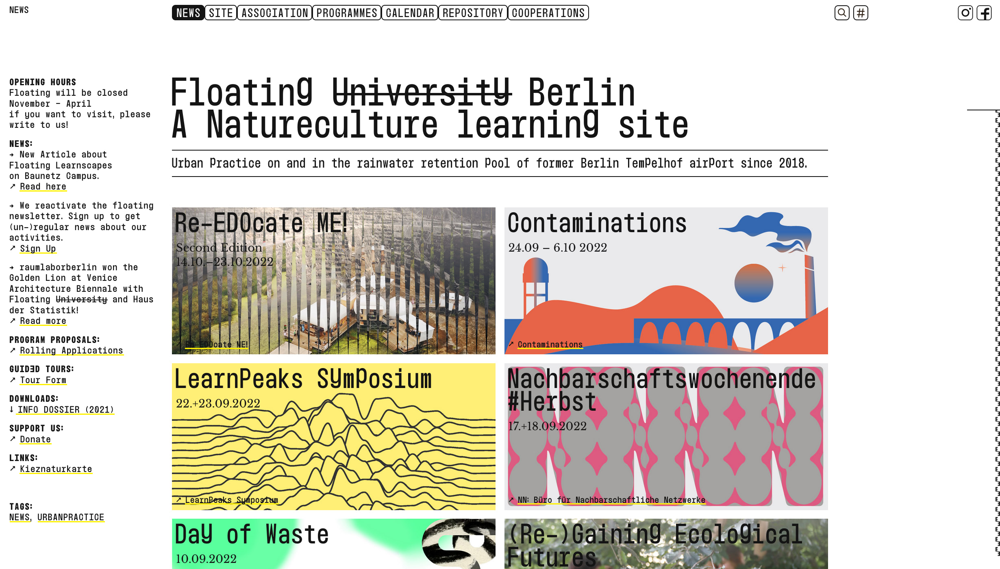
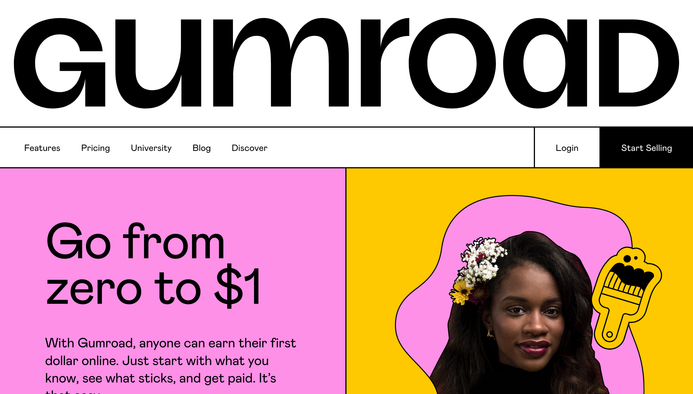
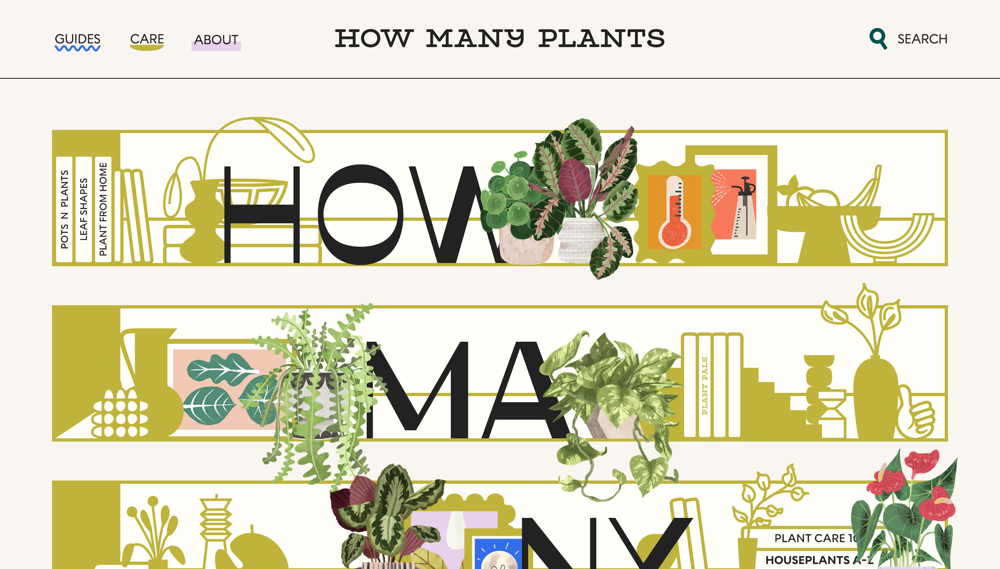
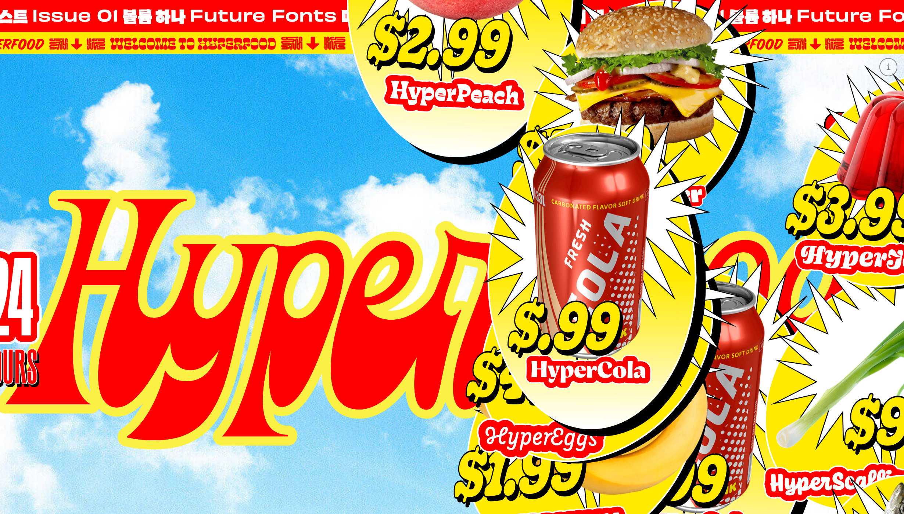

Here's another roundup of my favorite websites that I (re-)discovered in the recent months. As in the [last post](/favorite-websites-2020/), all of these pages are special to me because of their creative design and/or great content. If this year’s roundup had a theme, it would probably be “**bold”**.

<!--more-->

## [LOW←TECH MAGAZINE](https://solar.lowtechmagazine.com/)

<figure>

<figcaption>

With the yellow background of the page, users can check the current battery status of the solar battery that’s powering the site.

</figcaption>

</figure>

This is the solar-powered version of the [LOW-TECH MAGAZINE](https://www.lowtechmagazine.com/). The magazine itself publishes interesting articles on low-tech solutions to high-tech problems (or even very general problems, like [staying warm in winter](https://solar.lowtechmagazine.com/2022/01/the-revenge-of-the-hot-water-bottle)). It shows that good solutions are often already there and overlooked, and they don't need to involve a lot of tech.

## [Floating University Berlin](https://www.floatinguniversity.org/)

Floating Berlin’s (they dropped the “university” part of the name recently) open and experimental approach to education and culture is reflected in their brutalist-yet-playful website. Despite seeming a bit overwhelming at first, the page is actually very usable, and it’s easy to browse through their vast catalog of projects and programmes.

## [Gumroad](https://gumroad.com/)

I’ve known Gumroad for quite some years already. When I re-visited their homepage recently, their redesign made my jaw drop. Bold colors, huge headlines, subtle animations, and big contrasts – I love it! In [their blog](https://gumroad.com/blog/behind-gumroads-new-design-system) they explain the story behind the redesign, and how they improved the accessibility of their page as well. Congrats, Gumroad!

## [How Many Plants](https://howmanyplants.com/)

How Many Plants is an extremely cute page that’s not just a joy to explore, but also sports a good amount of super helpful plant information. Their [plant guides](https://howmanyplants.com/plant-guides) feature many houseplants, each with their own custom illustration and hints about how to take care of them. It’s incredible to see how much passion went into this project!

## [HyperText](https://hypertext.futurefonts.xyz/)

The type foundry [Future Fonts](https://www.futurefonts.xyz/) celebrated their first anniversary by building [HyperText](https://hypertext.futurefonts.xyz/), an assortment of highly-animated pages showcasing their font releases in ridiculous ways. My favorite is the HyperFood module, shown in the screenshot above. Aside from providing some amazing fonts, Future Fonts shows how much fun font demo pages can be!

This concludes this year’s roundup of my favorite websites!
