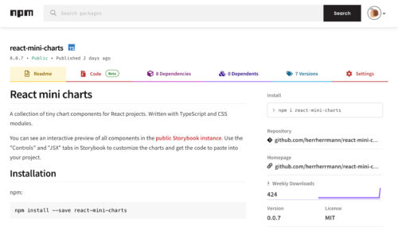
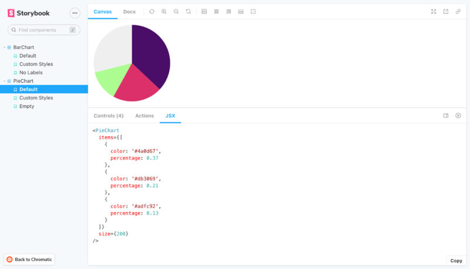

A few days ago, I published my first npm package: [react-mini-charts](https://www.npmjs.com/package/react-mini-charts)!

As the name suggests, it’s a small library of chart components for React. So far, there are only two charts available: a simple bar chart with labels and a pie chart (without any labels or legend). The bar chart component is an adapted and cleaned-up version of a component I’ve used for landing pages in the past. It’s basically just a bunch of styled HTML. The pie chart component is brand new and the first _SVG-based_ chart in the library!

<!--more-->

<figure>

<figcaption>
The pie chart component, as seen in the component library.  
The “JSX” tab shows the code to generate the component.
</figcaption>
</figure>

It took me a few hours to set up the repo how I wanted it, but now it has some cool features:

- There’s a live preview of the library in the shape of a [public Storybook instance](https://main--63ef4f8b97935401942de85b.chromatic.com) (deployed via Chromatic). It can be used to browse the different components and props, and it even generates JSX code, ready to be pasted into the target project.

- There’s a suite of tests that runs automatically for every pull request.

- There’s a modern build system based on [Rollup](https://www.rollupjs.org/), which supports different module formats and tree shaking.

This is just the beginning of react-mini-charts! I don’t expect many peeps to use it, but it’s a great learning environment. And working on it [in the open](https://github.com/herrherrmann/react-mini-charts) forces me to write good commit messages and documentation.
