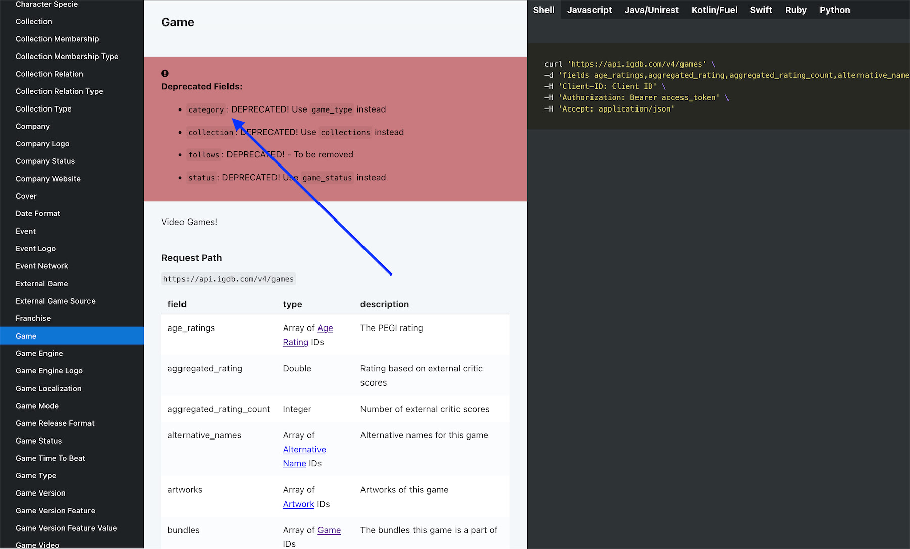
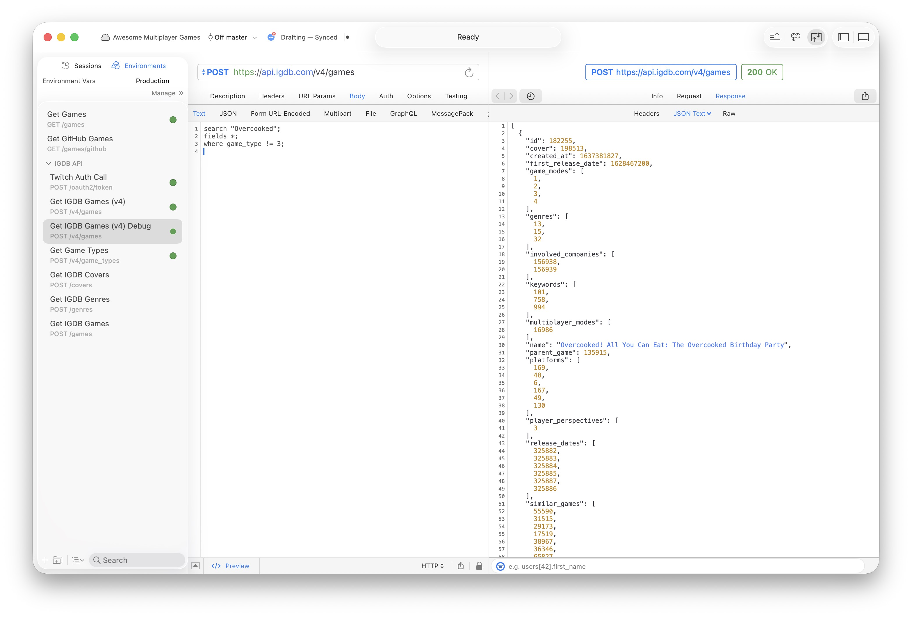

My little side project [Awesome Multiplayer Games](https://multiplayer.page/) was quite broken recently! Games were no longer showing up properly on the website (missing metadata and cover images). It was time to take a look at fixing it, because people have been adding new games to the [source list of games](https://github.com/herrherrmann/awesome-multiplayer-games/), and I want those additions to show up properly on the website. I remembered that I haven’t taken a look at the backend code for quite a while, and was also having trouble with the free service that was pausing or even shutting down my database every now and then. So, I was expecting to find some infrastructure issues that were causing the problems. Fortunately, the fix was much easier than doing any big migrations or updates, or starting to pay more for the hosting services.

## Debugging time

As a first step, I checked the backend logs, which revealed that the IGDB API requests stopped returning results (therefore not providing the required metadata that enriches the game list entries):

```
📥 Fetched from IGDB: "HOARD" => 0 result(s)
📥 Fetched from IGDB: "Screencheat" => 0 result(s)
📥 Fetched from IGDB: "Oh...Sir!! The Insult Simulator" => 0 result(s)
...
```

I was worried that my access to the IGDB API was revoked or the API key needed a refreshment. But that was not the issue. I found the potential root cause in their [API docs](https://api-docs.igdb.com/#game):



The `category` field is now deprecated, and should be replaced with the new `game_type` field! This is a big deal, because I’m using the `category` field to [filter games](<[category](https://github.com/herrherrmann/awesome-games-api/blob/cbcb804e6f7e8d68d0c61cba182dc29a68e23804/src/games/games.service.ts#L150)>) via the API’s proprietary query language. When using the old `category` field right now, the API just returns an empty list of games. Not ideal, but at least the change is clearly noted in the docs.

## The fix

So, changing the API call to use the new `game_type` field immediately made the API return games again, and the backend was back on track! With whopping 128 game recommendations. You should be able to find something to play with your friends there! 🎮

## Side notes

Since the aforementioned database pausing/shutdown struggle was still real, I also quickly moved the database setup over to the free plan of [Neon](https://neon.com/), which seems quite good so far!

I am also glad that I could use a little debugging environment with [RapidAPI](https://paw.cloud/) that I set up back then. That made it easy to figure out what the API is returning, and to verify that the fix was indeed just related to the changed field name.



## Next steps

I’m not very happy with how bloated and hard-to-upgrade the NestJS backend code has become. If I have more time in the next months, I might look into migrating to a simpler framework like Express, Hono, or Fastify.
