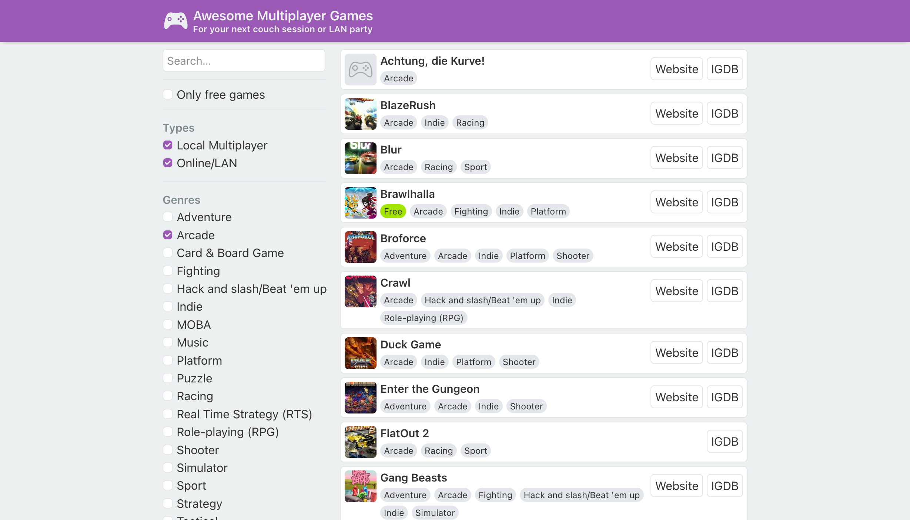

A list of… well, awesome multiplayer games! The content is [crowdsourced](https://github.com/herrherrmann/awesome-multiplayer-games) via GitHub, and I turned it into a little interactive [website](https://multiplayer.page/) with NestJS and React.

