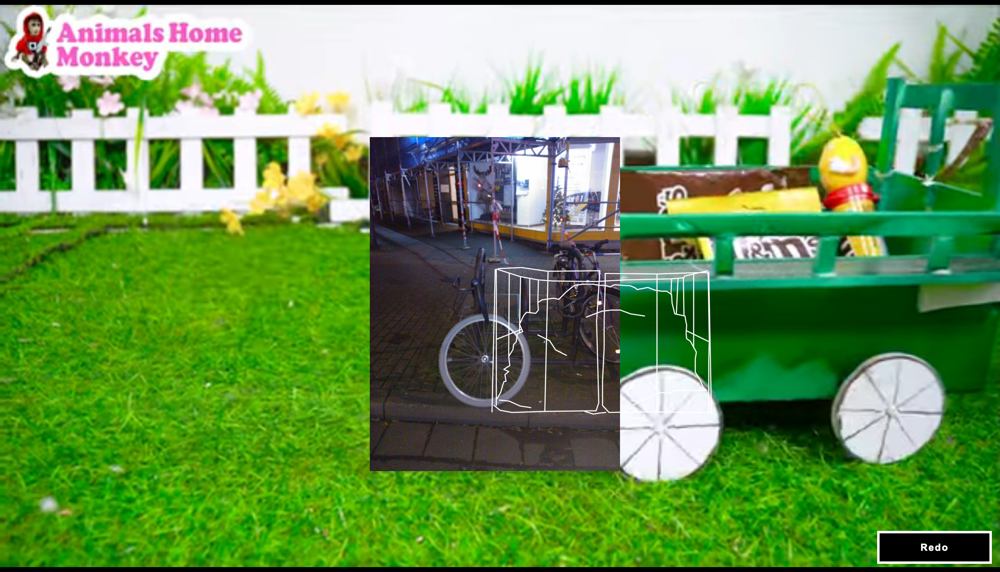

I implemented my friend Finz’ art project (and bachelor’s thesis) “Redo” as an [interactive website](https://re-do.ooo/). It uses the YouTube API to randomly load YouTube obscure videos with very few views, and displays them in the background alongside Finz’ illustrations and street photos.

It’s quite fun to play around with it, and see the different combinations unfold!

