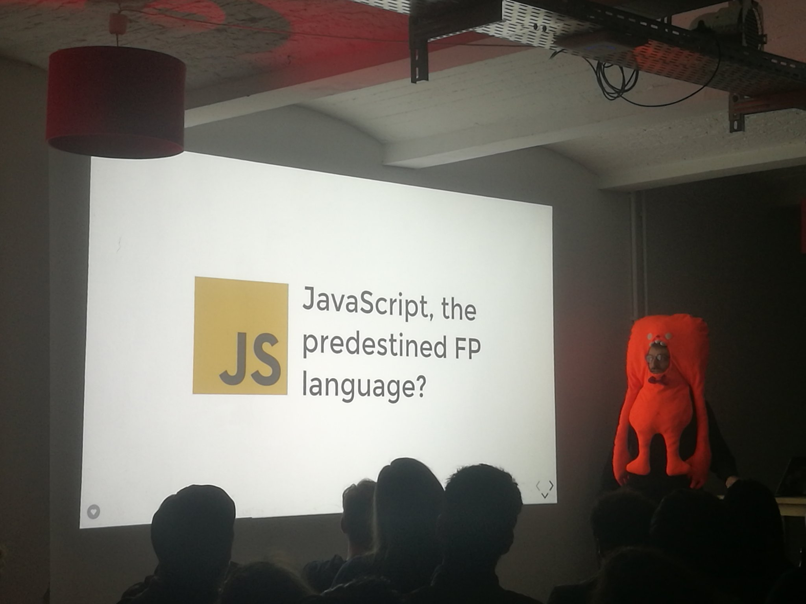

Tech talks are a great way to share knowledge and get into exchanges with other developers. I love giving talks, and have been doing that at TU Berlin, JSCraftCamp (München), JSUnconf (Hamburg), BerlinJS, Berlin Hack and Tell, and other occasions.

You’ll find many of my slides on [Slides.com](https://slides.com/herrherrmann). They are usually easy to follow, even without attending the talk itself.

## Teaching & mentoring

I’ve been a volunteer teacher for the JavaScript/React course at [ReDI School Berlin](https://www.redi-school.org/redi-school-berlin/) in 2018 and 2019. 👨‍🏫 It was a great pleasure, and I’ve met some amazing people there (co-teachers and students alike)!
