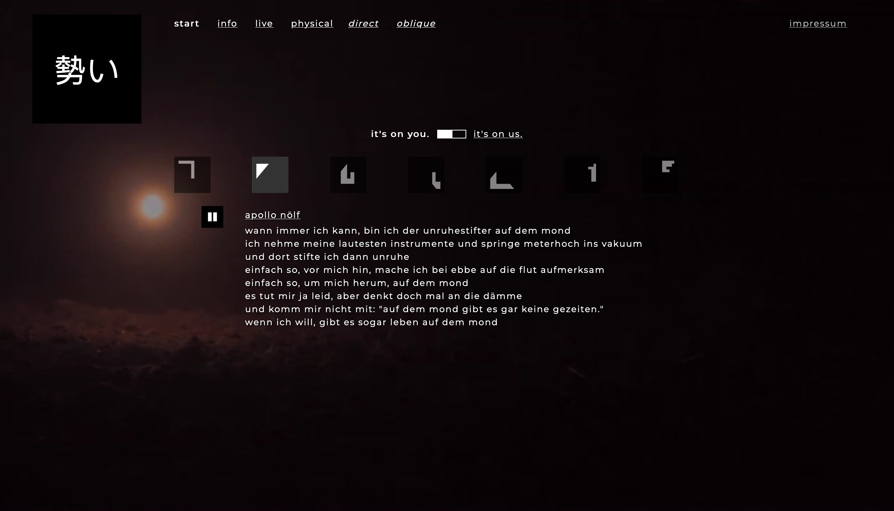

勢い was a band from Mainz that released an amazing album. I built an [immersive website](https://unruhe.org/) for them, including video backgrounds with transitions, and a web-based audio player for the whole album. The source code is available on [GitHub](https://github.com/herrherrmann/ikioi).

