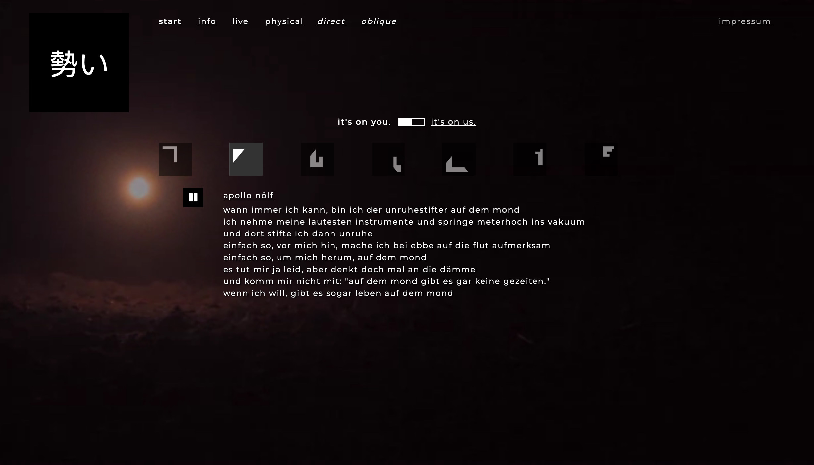

勢い was a post-hardcore band from Mainz that released an amazing album in 2016. I built an [immersive website](https://unruhe.org/) for them, including video backgrounds with transitions, and an audio player for the whole album. The source code is available on [GitHub](https://github.com/herrherrmann/ikioi).

